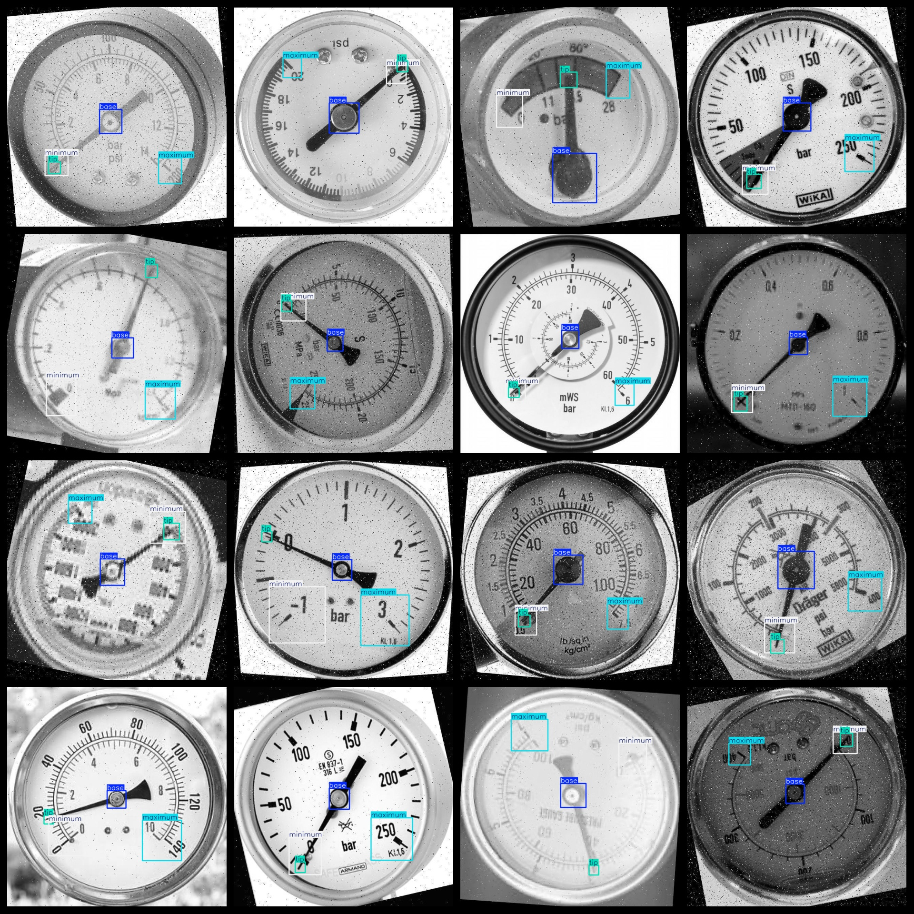

# Dashboard pointer position Detection Dataset 9155 imagesVOC+YOLO format

Dashboard pointer position detection dataset 9155 VOC + YOLO format

Dataset format: Pascal VOC format + YOLO format (the txt file does not contain the split path, it only contains jpg images and corresponding VOC format xml files and yolo format txt files)

Total number of images: 9155

Number of xml files: 9155

Number of txt files: 9155

Number of annotated categories: 4

The Github repository is: datasets_sl

```
["base", "maximum", "minimum", "tip"]
```

Number of boxes labeled in each category:

The base frame number is 9172 (center position).

Maximum Frame Count = 9086 (Maximum range)

Minimum Frames = 9229

The number of tip frames is 9535.

Total Frames: 37022

Number of images per category:

Base occupies 9154 images.

Maximum number of images owned = 9067

minimum annotated images = 9135

Tip ownership of 9151 images = 9151

Image resolution: 640x640 (some images have a general clarity)

Use the labeling tool: labelImg

Dataset Augmentation: Yes

Rules for annotation: Draw a rectangle around the category.

Important note: The dataset does not have been divided into training, validation, and testing sets.

Special Disclaimer: This dataset does not guarantee the accuracy of the trained models or weight files.

Annotation and image details are as follows:

## Images



---

Here is a pay link on Stripe (https://buy.stripe.com/3cs8yP7sY87d0vu9AB). Please contact me lonlonago@foxmail.com after funding $89, and I will send you a complete data files, thank you!


